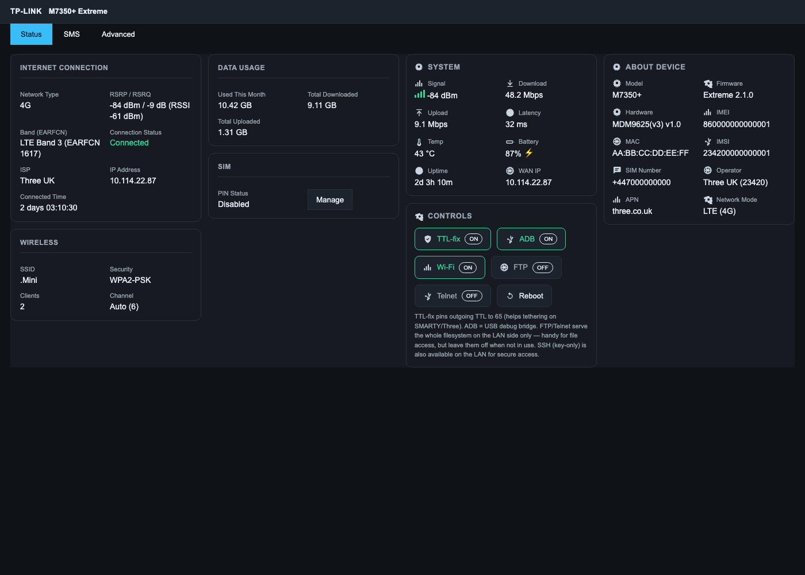
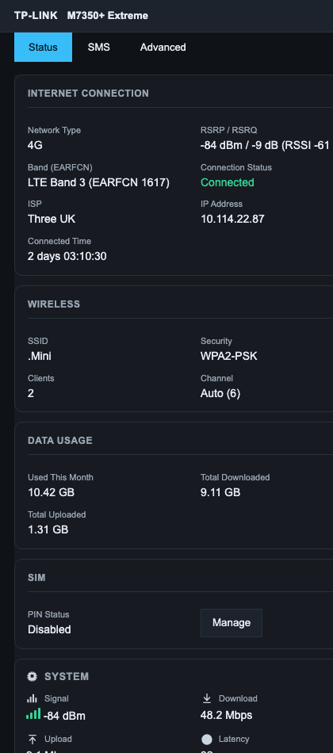
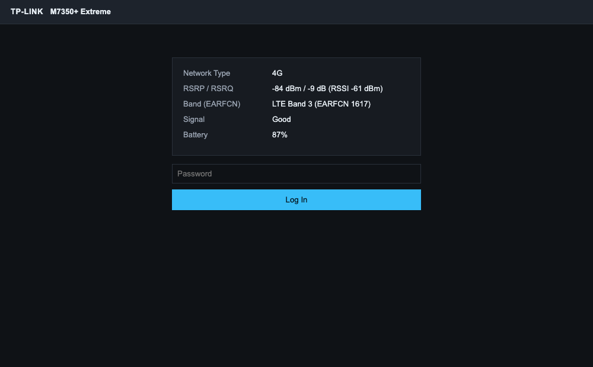

# TP-Link M7350 — LTE signal stats + dark UI mod

> **Use [v2.3.0](https://github.com/louij2/tp-link-m7350-signal-mod/releases) or
> later.** Earlier versions were progressively less safe by default: v2.0.0
> shipped the optional root tools (FTP/Telnet/web console) with **no
> authentication**; v2.1.0 added a password gate but still fell back to
> unauthenticated when no password was set; v2.2.0 stopped serving IMEI/IMSI/SIM
> unauthenticated; **v2.3.0 fails closed**, refusing every state-changing action
> until you create `/etc/signalmod.pw`.
>
> **Set a control password as part of installing:**
> `printf '%s' 'yourpassword' > /etc/signalmod.pw && chmod 600 /etc/signalmod.pw`

Add **live LTE signal metrics** (RSRP, RSRQ, RSSI, EARFCN, Band) and a **modern
dark theme** to the web UI of a TP-Link M7350 v3 portable 4G router — no firmware
reflash, just files dropped onto the device over ADB. Optionally add a
browser-based **root console** (password-gated) for deep debugging.

This is handy when the M7350 is used as a **USB-tether uplink** (e.g. into a
GL.iNet router): you can watch signal quality and the serving band straight from
`http://192.168.0.1` instead of guessing.

> Tested on **M7350 v3**, hardware Qualcomm **MDM9625**, firmware **1.1.3 Build
> 161226**. Other hardware revisions have different web assets and modem AT
> behaviour — read before you run.

---

## What you get

| Feature | Where |
|---|---|
| RSRP / RSRQ / RSSI, EARFCN, LTE **Band** (derived) | Login page status block **and** the post-login **Status** tab, under *Connection Status* |
| Colour-coded **signal-quality bar** | Same status views |
| Live **throughput** (↓/↑) + **latency** + **uptime** | Same status views |
| **System** panel (temp, WAN IP, signal bar, throughput, uptime) | Post-login Status tab |
| **Controls** panel: **Reboot**, **ADB on/off**, **TTL-fix on/off** | Post-login Status tab |
| **Prometheus** metrics endpoint (for Grafana) | `http://192.168.0.1/cgi-bin/metrics.sh` |
| Modern dark theme with **inline-SVG icons** (readable on every page, incl. Advanced) | Whole web UI (login + admin) |
| Root web console (optional) | `http://192.168.0.1/console.html` |
| Survives reboot | Daemon auto-starts via a SysV init script; all files live on persistent NAND |

**TTL-fix** pins the outgoing IP TTL on the mobile interface to 65 so the carrier
can't see per-hop decrement from tethered devices — handy against tethering
throttling on SMARTY/Three. It's a toggle (off by default) and is re-applied at
boot when left on. **ADB on/off** toggles the USB debug bridge from the browser
(turning it off drops adb until you turn it back on here or reboot). Both the
System and Controls panels are **post-login only**.

The stats come from a small daemon that polls the modem's AT channel every 5s and
caches JSON; the web UI reads that cache. The UI changes are injected by one
JavaScript file loaded from the page `<head>`, so nothing in the stock templates
is destructively rewritten.

---

## Screenshots

**Status tab** — the stock sections and the mod's own cards pack into one
dashboard grid, so the whole device state fits on a screen without scrolling:



**Narrow screens** — the same grid collapses to a single column:



**Login page** — signal is visible before you authenticate:



> These are rendered by `tools/mock/serve.sh`, which runs the real `sigmod.js`
> against a mock of the stock page with **synthetic** data — which is why no real
> IMEI, IMSI, MAC or phone number appears in them.

---

## ⚠️ Safety & scope

- **You need root ADB access already.** See *Gaining access* below — the initial
  ADB-enable step is firmware-dependent and is **not** re-derived here.
- The mod is **reversible**: `scripts/uninstall.sh` restores the stock pages from
  backups it made on first install.
- The **web console is an unauthenticated root shell**. It is **off by default**
  and gated behind an explicit `CONFIRM=yes`. Never enable it on an
  internet-exposed device.
- This targets **your own device**. It's a hobbyist customisation of hardware you
  own — treat it as such.

---

## Requirements

- A host with `adb` (Android platform-tools) and `bash`.
- The router connected over **USB** with ADB enabled.
- Default web login `admin` / `admin` (factory).

---

## Gaining access (root ADB)

This mod assumes you can already run `adb shell` as root on the device. On the
M7350v3 that is achieved by switching the **USB composition** so the ADB function
is exposed:

```
usb_composition = 902B   ->   RNDIS + ADB + Mass Storage
```

Once set, `adbd` (already shipped — see `/etc/init.d/adbd`) is reachable and
`adb shell` lands you as **root** (the device runs services as root; lighttpd
included).

> **How `usb_composition` is set is firmware/method specific** (community M7350
> root guides cover the web-UI/diag route for each firmware). This repo does not
> publish an exploit; it documents everything *after* you have the root shell.
>
> **Caveat found during this work:** on fw 1.1.3, `persist.usb.config` is empty,
> so the ADB-enabled composition may **not** persist across a factory-level
> reset/reflash. The *mod itself* persists fine (it lives on the normal rootfs);
> re-enabling ADB later is a separate step. Keep a note of how you enabled it.

---

## Install

> **This is a mod, not a reflash.** Nothing overwrites the NAND firmware image —
> it drops files onto the existing rootfs over root ADB and is fully reversible
> with `scripts/uninstall.sh`. You keep the stock firmware; you just get a better
> UI and some extra tools on top.

### From a release (recommended)

1. Download `m7350-extreme-mod-<version>.tar.gz` from the
   [Releases page](https://github.com/louij2/tp-link-m7350-signal-mod/releases)
   (verify with the `.sha256` alongside it).
2. Extract it and, with the router connected over root ADB (`adb devices` shows it):

```bash
tar xzf m7350-extreme-mod-*.tar.gz && cd m7350-extreme-mod-*
ADB=/path/to/adb ./scripts/backup.sh      # optional: snapshot stock pages first
ADB=/path/to/adb ./scripts/install.sh
```

Then open `http://192.168.0.1/` (login `admin`/`admin`). Optional extras:
`scripts/build-ssh.sh` (SSH), `scripts/enable-console.sh` (web console).

### From source

```bash
# from the repo root
ADB=/path/to/adb ./scripts/backup.sh          # optional but recommended: snapshot stock first
ADB=/path/to/adb ./scripts/install.sh
```

`install.sh`:

1. Backs up `login.html`, `status.html`, `settings.html` to `*.bak` on the device
   (once).
2. Pushes the signal daemon (`/usr/bin/signal_poll.sh`) and its init script
   (`/etc/init.d/signal_poll`, linked from `/etc/rc5.d/S98signal_poll`).
3. Pushes the CGI (`/WEBSERVER/www/cgi-bin/signal_stats.sh`) and the web assets
   (`sigmod.js`, `darkmode.css`).
4. Adds a single `<script src="sigmod.js">` tag to the `<head>` of `login.html`
   and `settings.html`.
5. Starts the daemon.

Then open `http://192.168.0.1/`, log in, and the **Status** tab shows the new
rows. First values appear within ~10s (one poll cycle).

### Uninstall

```bash
ADB=/path/to/adb ./scripts/uninstall.sh
```

Reverts the pages from `*.bak`, removes the mod files, the init script + boot
symlink, and stops the daemon.

---

## How it works

### 1. Signal daemon + cache (never touch the AT channel from CGI)

`/usr/bin/signal_poll.sh` owns a modem **AT channel** and polls it every 5s:

```
AT$QCRSRP?   -> RSRP + EARFCN     (Qualcomm proprietary)
AT$QCRSRQ?   -> RSRQ
AT+CSQ       -> RSSI (derived: -113 + 2*CSQ)
AT$QCSYSMODE -> LTE / WCDMA / GSM
```

It derives the **LTE band** from the EARFCN, adds **non-AT telemetry** (WAN
throughput from `/proc/net/dev`, uplink latency via `ping`, and uptime), and
writes `/tmp/signal.json`:

```json
{"rsrp":"-082.70","rsrq":"-06.50","rssi":"-53","earfcn":"1363","band":"3","mode":"LTE",
 "dl_kbps":"3074","ul_kbps":"5271","latency_ms":"17.885","uptime":"31060",
 "rx_bytes":"116736962","tx_bytes":"62990116"}
```

### Prometheus / Grafana

`cgi-bin/metrics.sh` re-exposes that cache in Prometheus text format
(`m7350_rsrp_dbm`, `m7350_downlink_kbps`, `m7350_latency_ms`, …). Point a
Prometheus scrape at `http://<router>/cgi-bin/metrics.sh` and graph your uplink
in Grafana. It only reads the cache — no privileged access.

The CGI (`cgi-bin/signal_stats.sh`) just `cat`s that cache with a JSON content
type. **Reading the AT channel directly from a CGI blocks and kills lighttpd** —
the daemon+cache split exists precisely to avoid that.

**AT-channel auto-failover.** The daemon probes `/dev/smd7`, then `/dev/smd8`,
then `/dev/smd11`, and uses the first that answers `AT$QCRSRP?`. If the current
channel stops responding for a few cycles it re-selects. This matters because an
smd channel can wedge (returns `EIO` on open) under heavy/*exotic* AT traffic;
failover keeps the stats alive instead of going blank. **Keep the AT set small
and standard** — hammering the channel with many/unknown commands is what wedges
it.

### 2. Web UI injection (the important part)

The M7350 web UI is a JS framework: `login.html` / `settings.html` are shells
whose scripts (`libs.min.js`, `tpweb.min.js`, `login.min.js`) **synchronously
rebuild the page body from templates** as they run. Two consequences:

- **Static rows added to the HTML get discarded** on render.
- **A `<script>` placed at the end of `<body>` never executes** — the framework
  rebuilds the body during parse, before the parser reaches your script.

The fix is `sigmod.js`, loaded from the **`<head>`**:

- It installs a `setInterval` that **re-creates the two rows whenever they are
  missing** (the interval closure isn't tied to any DOM node, so it survives
  every body rebuild) and re-fetches the JSON.
- It injects the dark theme as an **inline `<style>`** synchronously in the head,
  so the page paints dark from the first frame (a JS-injected external
  `<link>` loads async and left the post-login cards light-on-light).

It anchors the rows after the *Network Type* / *Connection Status* row on both the
pre-login block and the post-login Status tab.

### 3. Dark theme

`darkmode.css` (and the inline copy inside `sigmod.js`) is a pure override layer —
no markup changes. Note the selector gotcha it fixes: the status cards use
**camelCase** classes (`connectionSection`, `wifiSection`, …). CSS attribute
selectors are **case-sensitive**, so `[class*="section"]` misses them — you need
`[class*="Section"]` (or `.connectionSection` explicitly).

### 4. Boot persistence

- Files in `/usr/bin`, `/WEBSERVER/www`, `/etc` live on **persistent yaffs2 NAND**
  (`/` and `/usr` are `rw` mtd partitions), so they survive reboots.
- The daemon is started at boot by `/etc/init.d/signal_poll`, linked from
  `/etc/rc5.d/S98signal_poll` (runlevel 5, after lighttpd at S70).
- The init script launches with `nohup setsid` and the daemon detaches its own
  stdio, so it survives disconnect and does not hang init on a pipe.

> **Why not `start-stop-daemon`?** This device's busybox 1.18.5
> `start-stop-daemon -x /usr/bin/signal_poll.sh` **self-matches its own argv**
> (which contains that path) and decides the daemon is "already running", so it
> silently skips the start. `nohup setsid` + a `/proc` scan (excluding `$$`) is
> used instead.

---

## Optional: browser root console

A minimal in-browser terminal for deep debugging, off by default:

```bash
CONFIRM=yes ADB=/path/to/adb ./scripts/enable-console.sh
# then open http://192.168.0.1/console.html
ADB=/path/to/adb ./scripts/disable-console.sh   # remove it again
```

`console.html` POSTs a command to `cgi-bin/exec.sh`, which runs it as root under a
`timeout` (so a hung command can't wedge lighttpd) and streams stdout+stderr back.
Quick-buttons cover `signal.json`, `uptime`/`free`, `ps`, `ifconfig`, routes/DNS,
`dmesg`, daemon status.

**This is an unauthenticated root endpoint.** Only run it on a device you control
and never expose the web UI to the internet while it is installed.

> A real telnet daemon (`/sbin/telnetd`) and `nc` also exist on the device if you
> prefer a terminal over the web console — enabling a listening service is left to
> you and carries the same exposure caveats.

---

## Files

```
device/
  usr/bin/signal_poll.sh                 signal polling daemon (AT -> /tmp/signal.json)
  etc/init.d/signal_poll                 SysV init script (boot start)
  WEBSERVER/www/cgi-bin/signal_stats.sh  serves the cached JSON
  WEBSERVER/www/cgi-bin/metrics.sh       Prometheus metrics endpoint
  WEBSERVER/www/cgi-bin/sysinfo.sh       read-only System panel data (temp/mem/wan/ttl/adb)
  WEBSERVER/www/cgi-bin/control.sh       actions: reboot / adb on|off / ttl-fix on|off
  WEBSERVER/www/cgi-bin/exec.sh          root web-console backend (opt-in)
  WEBSERVER/www/sigmod.js                head-loaded UI injector + inline dark theme
  WEBSERVER/www/darkmode.css             dark theme (standalone copy)
  WEBSERVER/www/console.html             web-console UI (opt-in)
scripts/
  install.sh  uninstall.sh  backup.sh  enable-console.sh  disable-console.sh
```

---

## Customising it yourself (VS Code) + auto-deploy

All the UI text lives in **`device/WEBSERVER/www/sigmod.js`**. Common edits:

- **Device name** (next to the logo): `var MODEL = 'M7350 Extreme';`
- **Panel titles**: search for `'System'`, `'Controls'`, `'About Device'` inside `<h3>...</h3>`.
- **Stat labels**: the 2nd arg of `stat(icon, 'Label', id)` — e.g. `stat('thermo', 'Temp', 'spTemp')`.
- **Row labels**: `makeRow('sigRow', 'RSRP / RSRQ', 'sigRsrp')`.
- **Button text**: `'TTL-fix'`, `'ADB'`, `'FTP'`, `'Telnet'`, `'Reboot'`.
- **Theme colours**: the `--dk-*` variables at the top of `DARK_CSS`.

### Preview it without the device

The router is only on USB some of the time, so layout work does not need it at
all:

```bash
tools/mock/serve.sh        # http://127.0.0.1:8777/status.html
```

This serves the **real** `sigmod.js` against a mock of the stock page structure
with synthetic JSON in place of the CGIs, so theme and layout changes can be
checked in a normal browser. It says nothing about the CGIs or the modem — see
`tools/mock/README.md` for what it can and cannot prove.

### Then push it to the device

```bash
scripts/deploy.sh          # pushes JS+CGIs and auto-bumps the ?v= cache-buster
```

`deploy.sh` picks its transport automatically: **ADB** when the router is plugged
in over USB, otherwise **SSH** (the dropbear from `scripts/build-ssh.sh`). ADB is
preferred when available because it does not ride the LTE link and so cannot cut
itself off mid-deploy.

```bash
M7350_TRANSPORT=ssh scripts/deploy.sh      # force SSH
M7350_HOST=192.168.2.1 scripts/deploy.sh   # non-default LAN IP
M7350_SSH_TARGET=m7350 scripts/deploy.sh   # a ~/.ssh/config alias, user and key included
```

**Auto-deploy on merge:** run `scripts/install-hooks.sh` once. After that, editing +
committing (or merging a PR on GitHub and running `git pull` on the Mac that has the
device on USB) fires a `post-merge` hook that redeploys automatically. GitHub Actions
can't reach the USB-only device, so deployment is a local hook — until the device sits
behind a network path (e.g. tethered to a GL.iNet), where a self-hosted runner could
do it on merge.

## Roadmap / notes

- **Onboard OLED**: the device has an SSD130x-class OLED driven by `/usr/bin/oledd`
  over `i2c-3`, with a framebuffer at `/sys/class/display/oled/oled_buffer`,
  `panel_on`/`backlight_on` sysfs toggles, `ubus` events (`oled_panel_event`,
  `oled_backlight_event`), and font/resource files under `/etc/oled_res`
  (`/etc/oled_animation.config`). Showing RSRP/band on the physical display is a
  planned follow-up (needs on-device testing).
- **Operator / Cell ID / TAC**: `AT+COPS?` (operator) and `AT+CEREG?` (TAC + 28-bit
  E-UTRAN Cell Identity → eNB/cell) work on `/dev/smd7` but **not** on the
  fallback `/dev/smd8`. Planned as an opt-in once channel handling is hardened.

---

## Traps learned (save yourself the debugging)

- **`cat /dev/smd7` from a CGI hangs and kills lighttpd** → daemon+cache pattern.
- **The JS framework rebuilds the body**, discarding static rows *and* trailing
  `<body>` scripts → inject from `<head>` with a self-healing `setInterval`.
- **JS-injected external CSS paints late** (light flash / invisible text) → inject
  the theme as an inline `<style>` in the head.
- **CSS `[class*="section"]` is case-sensitive** → camelCase `…Section` cards
  need `[class*="Section"]`.
- **Don't `background: transparent` icons in a dark theme.** The stock UI draws
  every icon *and* the TP-LINK logo from one CSS sprite
  (`[class^=icon-]{background-image:url(images/sprites.png)}`); a `background`
  reset erases the image and the per-icon `background-position`, so all icons
  vanish. Leave `.icon-*` backgrounds untouched.
- **Heavy USB traffic can drop the RNDIS+ADB composition.** Sustained transfers
  destabilised the gadget and dropped ADB (and, with `persist.usb.config`
  empty, it came back without the ADB function). The RNDIS tether and web UI
  kept working. Don't stress-test throughput over the ADB link.
- **busybox `start-stop-daemon -x <script>` self-matches its own argv** → use
  `nohup setsid` + a `/proc` scan that excludes `$$`.
- **A `/proc` scan that greps for the daemon path matches the scanning shell
  itself** (its argv contains the path) → always exclude `$$`.
- **Non-interactive `adb shell "cmd &"` kills the child on disconnect**; a plain
  `setsid` shell-script child dies, while `nohup setsid` (or launch under a PTY,
  `adb shell -t`) survives. At boot, init has no such teardown.
- **busybox `sed` won't put a real newline in an append/replace** → patch HTML on
  the host, and insert the `<script>` tag on the same line as `</head>`.
- **An smd AT channel can wedge (`EIO` on open)** under heavy/unknown AT traffic →
  keep the command set small; the daemon auto-fails-over to another channel.
- **`persist.usb.config` is empty on fw 1.1.3** → the ADB-enabled USB composition
  may not survive a factory reset; the mod files themselves do persist.

---

## Contributing / branching

- `main` is the released line; tags (`v2.0.0`, …) mark releases.
- Do day-to-day work on `dev` (or feature branches off it), then PR into `main`.
- If you've run `scripts/install-hooks.sh`, merging/pulling auto-deploys to a
  connected device — so keep `main` deployable.
- Cut a release: bump `VERSION` + update `CHANGELOG.md`, `scripts/make-release.sh`,
  tag `vX.Y.Z`, and attach the tarball to a GitHub Release.

## License

MIT — see `LICENSE`. Provided as-is; you are responsible for what you run on your
own hardware.
